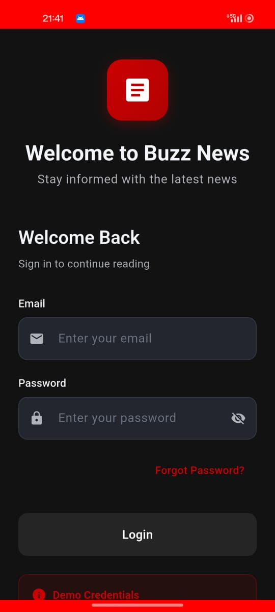
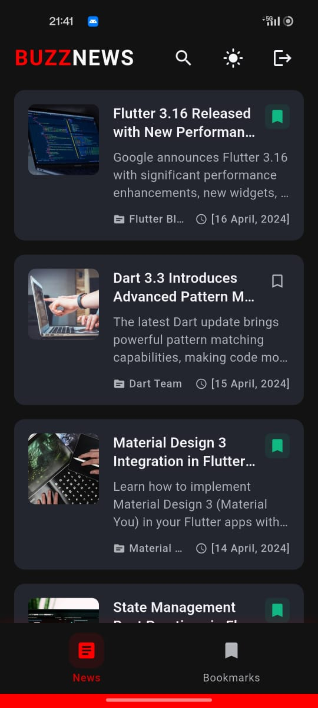
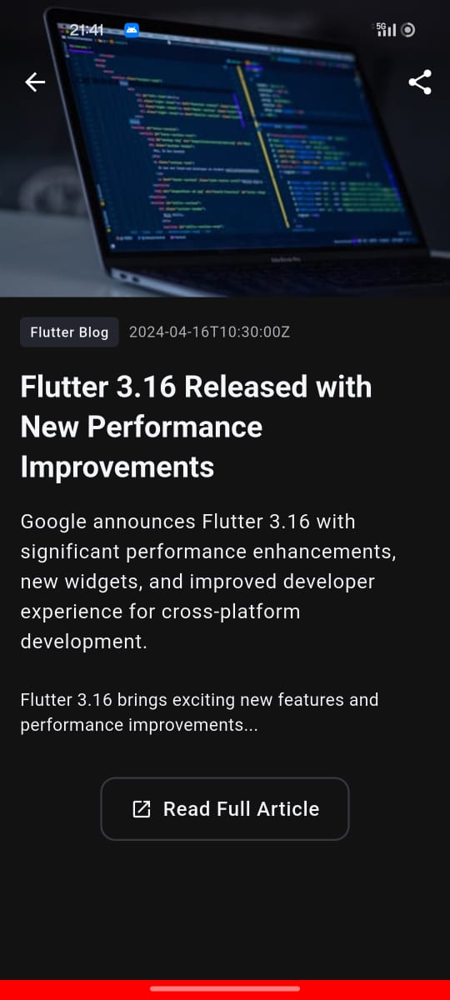
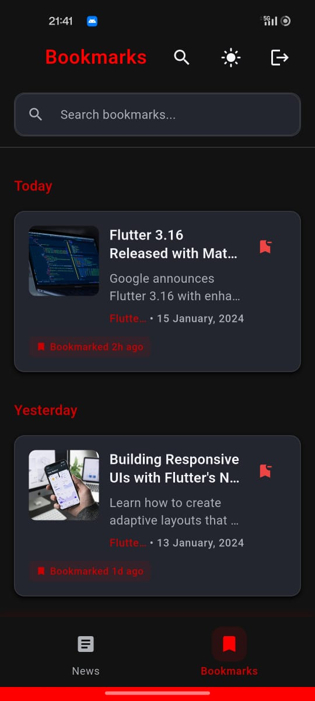

# 📰 Buzz News - A Flutter News App

**Buzz News** is a clean, responsive, and modern Flutter application that allows users to stay updated with the latest news, bookmark articles, and seamlessly switch between news and saved content. Developed as part of a coding task for **Aibuzz Technoventures Pvt Ltd**.

---

## 🚀 Features

### 🔐 Login Page
- Email and password fields
- Simple validation (empty check + email format)
- No backend – only local session saved
- Session persistence using `shared_preferences`

### 📰 News Feed
- Fetches news from [NewsAPI.org](https://newsapi.org/)
- Displays:
  - Thumbnail image
  - Title and short description
  - Source name
  - Formatted publish date (`e.g. 16 April, 2025`)
- Tap article → opens in in-app WebView
- Bookmark/unbookmark any article
- Pull-to-refresh support

### 🔖 Bookmarks
- Stores bookmarked articles locally
- Persistent across app restarts
- Option to remove from bookmarks

### 🧭 Navigation
- Bottom TabBar to switch between News and Bookmarks
- Smooth transitions and minimal UI

### 🌙 Optional Enhancements
- Dark Mode support
- Responsive layout using `sizer`
- Toast feedback
- Share articles via other apps

---

## 📷 Screenshots

> Add your actual screenshots in a `/screenshots` folder and update the paths below.

| Login | News Feed | WebView | Bookmarks |
|-------|-----------|---------|-----------|
|  |  |  |  |

---

## 🧑‍💻 Project Structure

lib/
├── models/ # Article model
├── services/ # API & Bookmark services
├── providers/ # Bookmark provider (state management)
├── screens/ # UI: Login, News, Bookmarks
├── widgets/ # Custom UI widgets
├── utils/ # Date formatting, theming, etc.
└── main.dart # Entry point with routing and theme setup

---

## 📦 Packages Used

| Package | Reason |
|--------|--------|
| [`dio`](https://pub.dev/packages/dio) | For fetching news with advanced networking |
| [`cached_network_image`](https://pub.dev/packages/cached_network_image) | Image loading and caching |
| [`flutter_svg`](https://pub.dev/packages/flutter_svg) | To render SVG icons/assets |
| [`shared_preferences`](https://pub.dev/packages/shared_preferences) | To persist login and bookmarks |
| [`connectivity_plus`](https://pub.dev/packages/connectivity_plus) | To check network status |
| [`fluttertoast`](https://pub.dev/packages/fluttertoast) | Display user-friendly toast messages |
| [`sizer`](https://pub.dev/packages/sizer) | For responsive UI layouts |
| [`fl_chart`](https://pub.dev/packages/fl_chart) | (Optional) For future visual data enhancements |
| [`google_fonts`](https://pub.dev/packages/google_fonts) | To enhance typography with custom fonts |
| [`flutter_dotenv`](https://pub.dev/packages/flutter_dotenv) | To manage environment variables (API key) |
| [`webview_flutter`](https://pub.dev/packages/webview_flutter) | To open article URLs within the app |
| [`share_plus`](https://pub.dev/packages/share_plus) | For article sharing functionality |
| [`web`](https://pub.dev/packages/web) | Flutter web compatibility support (optional) |

---

